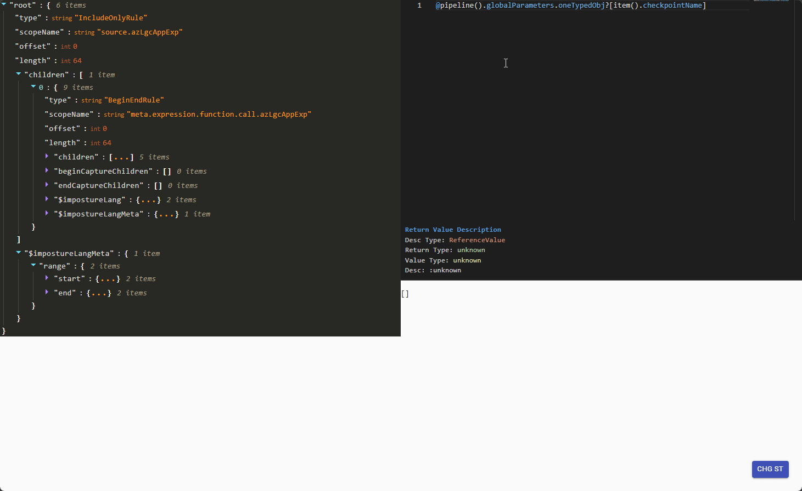

<h1 align="center">monaco-imposture-tools</h1>

monaco-imposture-tool is a set of compiler toolchain technologies, which can be used to quickly develop a front end for certain programming languages.

> *Nothing but a frontend for Azre logic app expressions*

[Live demo](https://red-moss-09b26e710.azurestaticapps.net/)

If you need a GPT model for Azure logical app expression, try [azLgcGpt](https://huggingface.co/albertleigh/azlgc-gpt)
